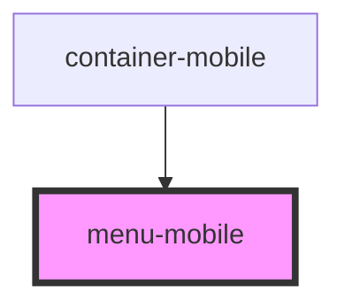

# menu-mobile

<!-- Auto Generated Below -->

## Properties

| Property     | Attribute     | Description | Type     | Default     |
| ------------ | ------------- | ----------- | -------- | ----------- |
| `simpleText` | `simple-text` |             | `string` | `undefined` |

## Dependencies

### Used by

 - [container-mobile](../container-mobile)

### Graph

----------------------------------------------

*Built with [StencilJS](https://stenciljs.com/)*
